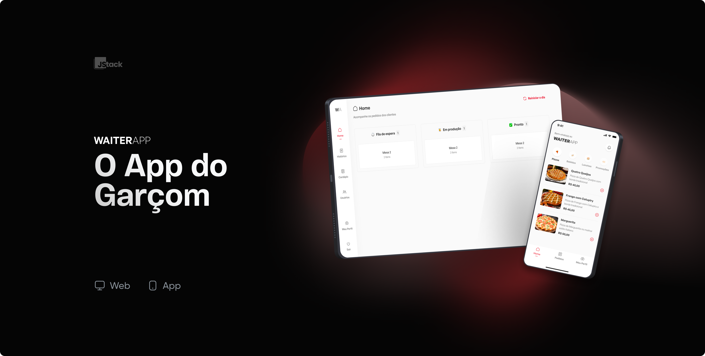
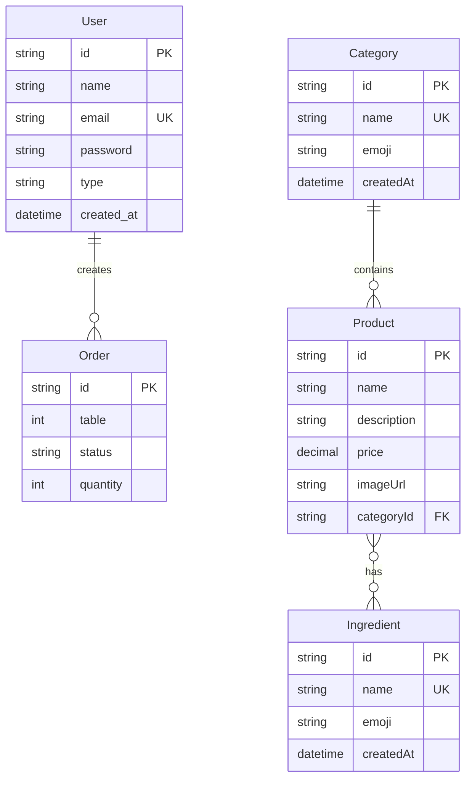

# WaiterApp v2

Sistema completo de gestão de restaurante com aplicação web, mobile e API robusta para controle de pedidos, usuários e cardápio.



## Tecnologias

### Backend
- **Fastify** - Framework web rápido e eficiente
- **Prisma** - ORM moderno com type-safety
- **Zod** - Validação de schemas e types
- **PostgreSQL** - Banco de dados relacional
- **JWT** - Autenticação e autorização
- **AWS S3** - Upload de imagens com presigned URLs

### Frontend Web
- **React** - Biblioteca de interface de usuário
- **TanStack Router** - Roteamento type-safe
- **Tailwind CSS** - Framework CSS utility-first
- **React Query** - Gerenciamento de estado servidor

### Mobile
- **React Native** - Framework mobile multiplataforma
- **Expo** - Plataforma de desenvolvimento
- **StyleSheet** - Estilização nativa

## Funcionalidades

### Autenticação e Usuários
- Login com email e senha
- Registro de garçons (apenas admins)
- Edição e exclusão de usuários
- Recuperação de senha via email
- Refresh token automático
- Rate limiting para tentativas de login
- Criptografia de senhas com bcrypt

### Gestão do Cardápio
- Cadastro de categorias com emoji
- Cadastro de ingredientes
- Cadastro de produtos com:
  - Nome, descrição e preço
  - Categoria associada
  - Ingredientes selecionados
  - Upload de imagem

### Pedidos
- Criação de pedidos por mesa
- Status de pedido: Aguardando, Em Produção, Finalizado
- Controle de quantidade

### Upload de Arquivos
- Presigned URLs para upload direto no S3
- Processamento via AWS Lambda
- Otimização automática de imagens

## Estrutura do Banco

### ERD (Entity Relationship Diagram)



## Regras de Negócio

### Usuários
- Senhas criptografadas obrigatoriamente
- Apenas admins podem gerenciar garçons
- Rate limiting: máximo 5 tentativas de login por minuto
- Bloqueio temporário após múltiplas tentativas incorretas
- Recovery de senha via email com token temporário

### Produtos
- Categorias obrigatórias para produtos
- Preços com precisão decimal (10,2)
- Upload de imagens obrigatório
- Ingredientes opcionais por produto

### Pedidos
- Mesa obrigatória para identificação
- Status padrão: "Em Produção"
- Quantidade mínima: 1 item

## API Endpoints

### Autenticação
```
POST /auth/login       # Login de usuário
POST /auth/refresh     # Renovar token
POST /auth/forgot      # Solicitar reset de senha
POST /auth/reset       # Resetar senha
```

### Usuários (Admin apenas)
```
POST /users            # Criar garçom
GET /users             # Listar usuários
PUT /users/:id         # Editar usuário
DELETE /users/:id      # Deletar usuário
```

### Cardápio
```
GET /categories        # Listar categorias
POST /categories       # Criar categoria
PUT /categories/:id    # Editar categoria
DELETE /categories/:id # Deletar categoria

GET /ingredients       # Listar ingredientes
POST /ingredients      # Criar ingrediente
PUT /ingredients/:id   # Editar ingrediente
DELETE /ingredients/:id # Deletar ingrediente

GET /products          # Listar produtos
POST /products         # Criar produto
PUT /products/:id      # Editar produto
DELETE /products/:id   # Deletar produto
```

### Upload
```
POST /upload/presigned # Gerar URL de upload
```

### Pedidos
```
GET /orders            # Listar pedidos
POST /orders           # Criar pedido
PUT /orders/:id        # Atualizar pedido
DELETE /orders/:id     # Cancelar pedido
```

## Status do Projeto

### ✅ Implementado
- Autenticação básica (login/logout)
- CRUD de usuários, categorias, ingredientes e produtos
- Estrutura do banco de dados
- APIs básicas do backend
- Interface web responsiva
- App mobile básico

### 🚧 Em Desenvolvimento
- Upload de arquivos com presigned URLs
- Sistema de refresh token
- Rate limiting e segurança
- Recovery de senha
- Sistema de emails
- Funcionalidades avançadas de pedidos

### 📋 Próximas Funcionalidades
- Dashboard administrativo
- Relatórios de vendas
- Notificações push
- Sistema de mesas
- Integração com impressoras
- Modo offline

## Estrutura de Pastas

```
waiterapp-v2/
├── backend/
│   ├── src/
│   ├── prisma/
│   └── package.json
├── frontend/
│   ├── src/
│   ├── public/
│   └── package.json
├── mobile/
│   ├── src/
│   ├── assets/
│   └── package.json
└── README.md
```

## Licença

Este projeto está sob a licença MIT.